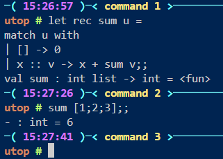

# Tour of OCaml

[Last read](https://ocaml.org/docs/tour-of-ocaml#data-and-typing)

* OCaml never implicitly converts values frome one type to another. 
* OCaml's **type inference** algorithm computes a type for each expression, requires minimal annotation. 

## Floats + Ints

Floats use `+.` and `*.` to perform arithemtic between floats

Regular operators are used on Ints

To cast a resulting type to an operation with both floats and ints, use `float_of_int`
```
float_of_int 1 +. 2.5;;
// casts 1 to float
// perform addition between floats with +.
```

## Lists

**Defined as an element `x` added to the front of another list `u`. Written as: `x :: u`, where `::` is called "cons"**

Lists specify their parameterized types: 
- `nil` - `[]` - `a' list`
- `[1; 2; 3;]` - `int list`
- `[false; false; true;]` - `bool list`
- `[[1;2]; [3]; [4;5;6]]` - `int list list`
  - the individual elements are of type `int list` 

## Pattern Matching

**Inspect data of any kind, except functions by comparing expressions to an inspected value**

Example: A recursive function to compute the sum of a list of integers
```ocaml
(*recall that there is syntactic sugar to define functions, 
and function inputs are separated by spaces*)
let rec sum u = 
    match u with
        | [] -> 0
        | x :: v -> x + sum v;;
(*sum is a value with the function type, and input type int list, and output type int.

To use the sum function, call sum <input list>;;
*)

```


### Polymorphic Functions on Lists

Example: Compute the length of any list (no matter what type parameter)

```ocaml
let rec length u = 
    match u with 
        | [] -> 0
        | _ :: v -> 1 + length v;;

(* recursive function length has input type 'a list and output type int
*)
(* _ is used as a placeholder as it is not used in the pattern, thus does not need a name)
```

### Modules, Definitions, and Using option data type

`option` typed detailed in [Modules + Standard Library](https://ocaml.org/docs/tour-of-ocaml#modules-and-the-standard-library).

Definitions provided in a module are listed by appending the module name to the definition: 

`Option.map;;` returns the type definition of the map from the Option module.

The `option` typed is defined as:  `type 'a option = None | Some of 'a`. 
- It handles cases where a value may be absent
- Allows flexibility when working with functions that may not return a value

```ocaml
let f opt = match opt with
    | None -> None
    | Some None -> None (* The case where opt holds a value that is also an option, and has the value None*)
    | Some (Some x) -> Some x;; (*The case where opt holds a value that is also an option*)


```

## Higher Order Functions

**Defined as functions that take in functions as parameters.**

Example: `List.map` can be written using pattern matching on lists:

```ocaml

let square xc = x*x;;

let rec map f u = 
    match u with
        | [] -> []
        | x :: u -> f x :: map f u;;

```
## Pairs and Tuples

Tuples: fixed lengthed collections of elements(any type)

Example: `(1, 'one', true)` is a valid tuple of type `int * string * bool`

## Variant Types

**Generalizes enumerated and union types.**

```ocaml
type primary_color = Red | Green | Blue;;

[Red; Green; Blue];; (* A list with element type primary_color*)

```