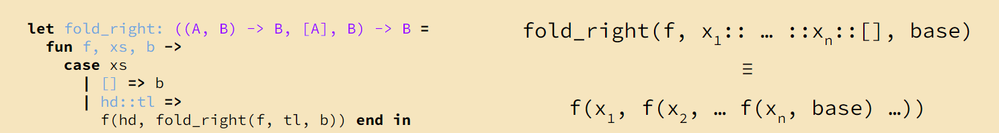
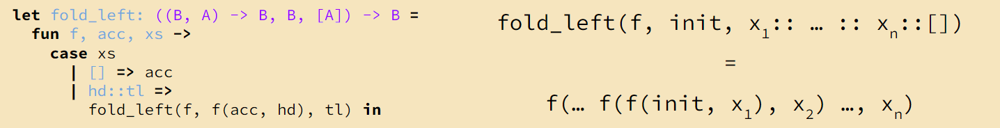

# Discussion 2

Higher Order Functions (Composition)

## fold_right

`fold_right` is a Higher Order Function where it acts as a map across a variable, and case matches on a base case

```
# Hazel

let fold_right: ( (A,B) -> B,[A],B ) -> B = 
    fun f, xs, b -> 
        case xs
            | [] => b
            | hd::tl => 
                f(hd, fold_right(f, tl, b)) end in 

# (A,B) -> B // function f that takes in type A, and base case B
# [A] // xs, a list of type A
# B // base case b
# fold_right outputs type B 
    // "right" referring to how the function f is appllied to the rightmost element first (the last element)
    // generates a set of function calls separated by parentheses starting with the rightmost case 
```


**Imperatively: Think fold_right is a while loop that interacts with a stack**
*NOTE: from cons tree perspective, think post-order traversal*

## fold_left

Similar logic to fold_right, **except recursive call processes and finishes leftmost element first**

```
let fold_left: ( (B,A) -> B, B, [A]) -> B = 
    fun f, acc, xs -> 
        case xs
            | [] => acc
            | hd::tl =>
                fold_left(f, f(acc, hd), tl)

# (B,A) -> B // function f that takes in base case B, and type A
# B // base case b
# [A] // xs, a list of type A
# fold_left outputs type B 
    // "left" referring to how the function f is appllied to the leftmost element first (the first element)
    // generates a set of function calls separated by parentheses starting with the leftmost case 
```


**Imperatively: Think fold_left is a while loop that interacts with a queue**

*NOTE: from cons tree perspective, think pre-order traversal*

## Example: Convert concat function into a function that implements fold_right

Given fold_right, and concat defined below, what are the inputs into fold_right for the concat function?

```
// Concat Function
let concat: [String] -> String =
    fun xs -> 
        case xs 
            | [] => ""
            | hd::tl =>
                hd ++ concat(tl) end in
```

```
// Concat Function (using fold_right)

let concat: [String] -> String = 
    fun xs -> fold_right(
        fun x, tl -> x ++ tl, 
        xs, 
        "") in 
```

## Example: Repeat Under 2s

```
// repeat_under_2s function 
let repeat_under_2s: [Int] -> [Int] 
    fun xs -> 
        case xs
            | [] => []
            | hd::tl => if hd < 2 then hd::hd::repeat_under_2s(tl)
                else hd::repeat_under_2s(tl) end
    in
```

```
let repeat_under_2s: [Int] -> [Int] = 
    fun xs -> fold_right(
        fun hd, tl -> if hd < 2 then hd::hd::tl else hd::tl, 
        xs, 
        []
    )
```

## Intuition: Using fold_left vs. fold_right

* Use `fold_left` when:
  * There is some starting initial accumulator value
  * As you iterate over a list, you must consider the previous accumulator in addition to each element
  * Build the next accumulator value with previous accumulator value and current element
* Use `fold_right` when:
  * Thinking with traditional recursion
  * When given a non-empty list, solve the problem recursively by combining the solution for the tail with the head element's solution to solve the whole list
  * When given an empty list, the base case is the final value
